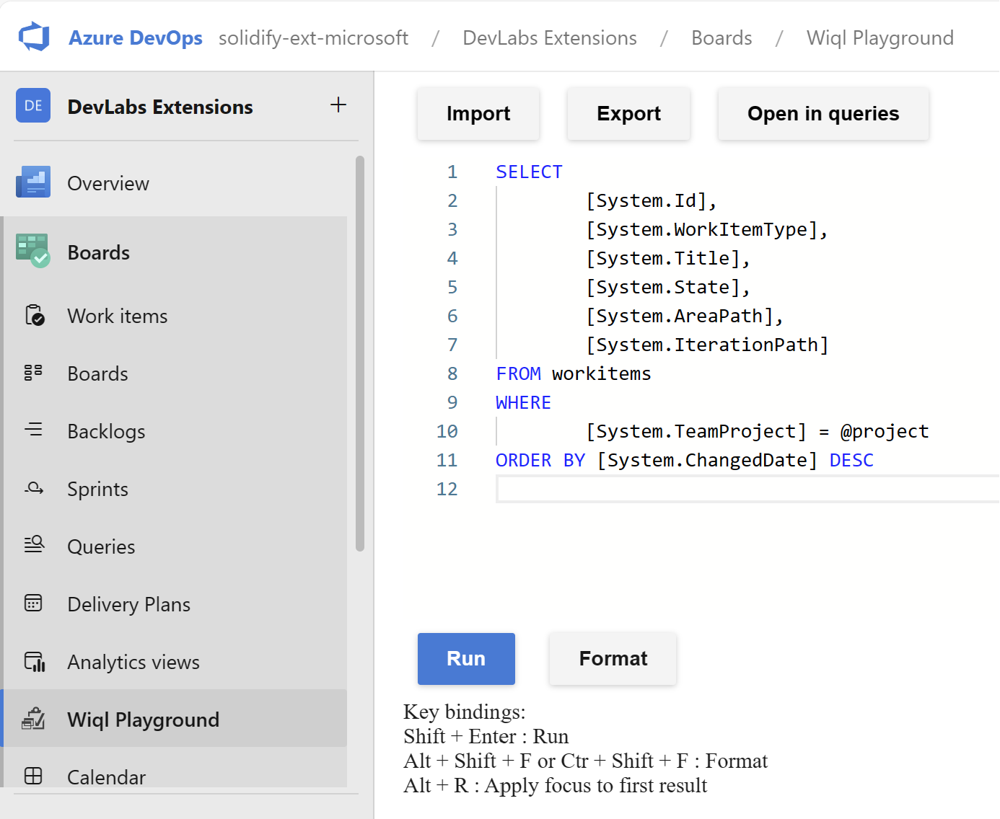
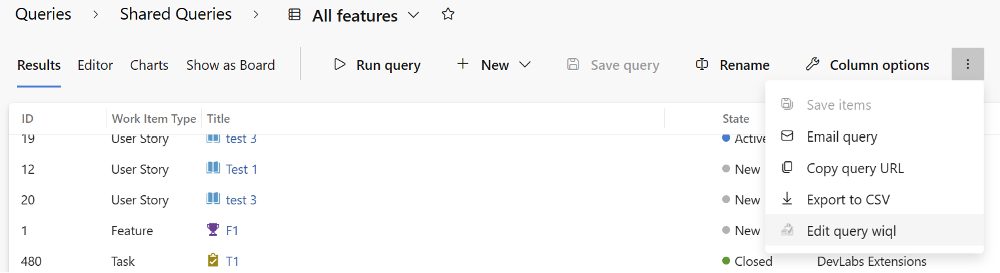
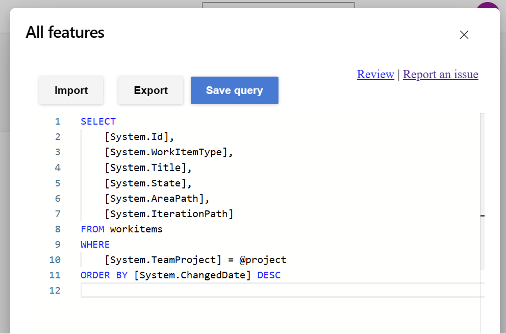

# wiql editor

> **Note:** This is the supported [Microsoft DevLabs](https://marketplace.visualstudio.com/publishers/Microsoft%20DevLabs) version of the original [Wiql Editor](https://marketplace.visualstudio.com/items?itemName=ottostreifel.wiql-editor), written by [Otto Streifel](https://github.com/ostreifel).
> 
> If you are using Azure DevOps Service (cloud) or Server version 2019 and later then you should use this version of the extension. The legacy extension will be available for users of of Azure DevOps server 2018 and earlier. 

Search work items with the expressiveness of the work item query language.

## Explore the wiql syntax on the wiql playground  

## Use the wiql editor to modify existing queries

## Save changes to the query when finished.  

 

# Why?

The wiql editor provides additional features to manage work item queries, including

- Access hidden wiql features
  - asof queries
  - ever contains words
- Bulk move/copy/paste query clauses
- Easier to read queries with lots of clauses or heavily nested clauses.
- Import export queries
- Better editor load times for exceptionally large queries

# Reference 
https://docs.microsoft.com/en-us/vsts/collaborate/wiql-syntax?view=vsts

# Support

## How to file issues and get help

This project uses [GitHub Issues](https://github.com/microsoft/wiql-editor/issues) to track bugs and feature requests. Please search the existing issues before filing new issues to avoid duplicates. For new issues, file your bug or feature request as a new Issue. 

For help and questions about the extension use [GitHub Discussions](https://github.com/microsoft/wiql-editor/discussions).

## Microsoft Support Policy

Support for this project is limited to the resources listed above.