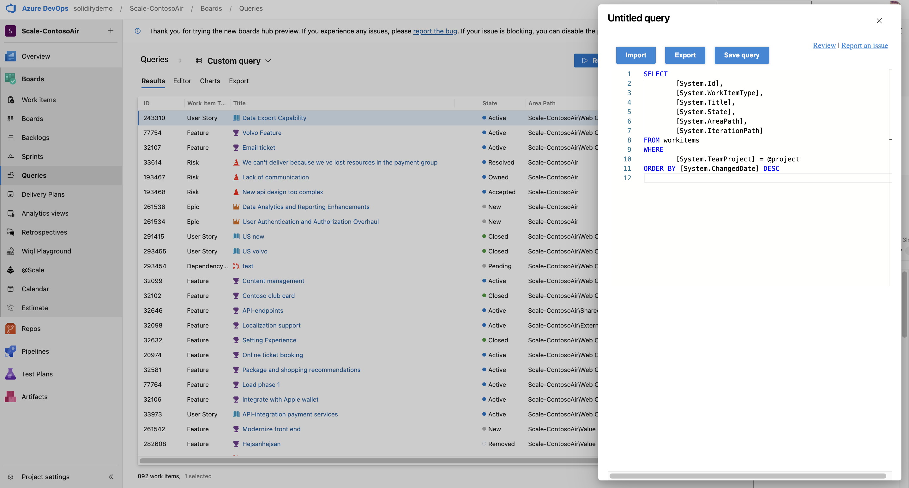

Wiql Editor

The WIQL Editor by Microsoft DevLabs enhances work item query management in Azure DevOps Service (cloud) and Server 2019+. This tool leverages the Work Item Query Language (WIQL) for complex searches. Features include an interactive WIQL Playground, easy query modifications, direct save options, and improved query readability. Additionally, the editor offers import/export capabilities and faster load times, making it essential for efficient work item query management.

# Documentation

1. Create WIQL Query

- Write your WIQL query in the editor.
- Click on "Run" to execute the query.
2. Save the Query

- Click on "Export" to save the query.
3. Import an Existing Query

4. Click on "Import" to load an existing query.
5. open Queries View

- Click on "Open Queries" to access the queries view.
 
 6. Edit Query
 - Click on "Edit Query" in queries view.

# Support

## How to file issues and get help

This project uses [GitHub Issues](https://github.com/microsoft/wiql-editor) to track bugs and feature requests. Please search the existing issues before filing new issues to avoid duplicates. For new issues, file your bug or feature request as a new Issue. 

## Microsoft DevLabs
Microsoft DevLabs is an outlet for experiments from Microsoft, experiments that represent some of the latest ideas around developer tools. Solutions in this category are designed for broad usage, and you are encouraged to use and provide feedback on them; however, these extensions are not supported nor are any commitments made as to their longevity.