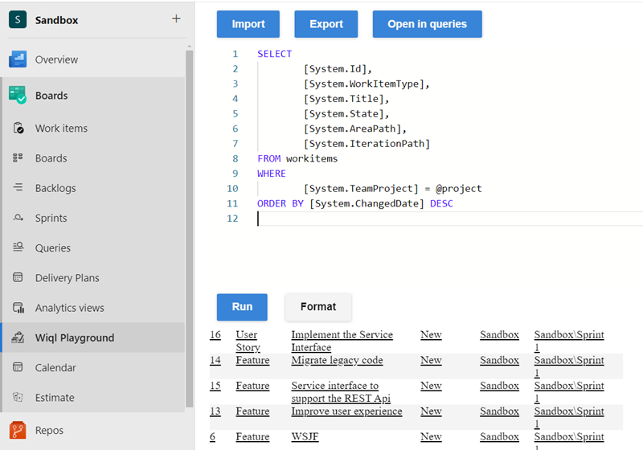
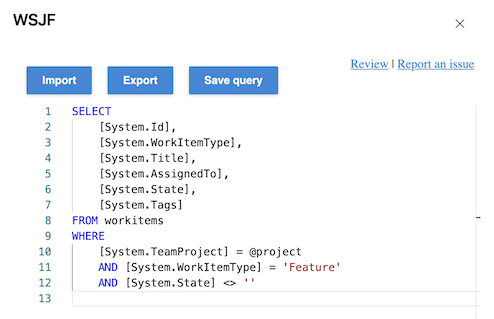

# Wiql Editor

The WIQL Editor by Microsoft DevLabs enhances work item query management in Azure DevOps Service (cloud) and Server 2019+. This tool leverages the Work Item Query Language (WIQL) for complex searches. Features include an interactive WIQL Playground, easy query modifications, direct save options, and improved query readability. Additionally, the editor offers import/export capabilities and faster load times, making it essential for efficient work item query management.

# Documentation

> **Note:** This is the supported [Microsoft DevLabs](https://marketplace.visualstudio.com/publishers/Microsoft%20DevLabs) version of the original [Wiql Editor](https://marketplace.visualstudio.com/items?itemName=ottostreifel.wiql-editor), written by [Otto Streifel](https://github.com/ostreifel).
>
> If you are using Azure DevOps Service (cloud) or Server version 2019 and later then you should use this version of the extension. The legacy extension will be available for users of of Azure DevOps server 2018 and earlier.

Search work items with the expressiveness of the work item query language.

## Why?

The wiql editor provides additional features to manage work item queries, including

- Access hidden wiql features
  - asof queries
  - ever contains words
- Bulk move/copy/paste query clauses
- Easier to read queries with lots of clauses or heavily nested clauses.
- Import export queries
- Better editor load times for exceptionally large queries

## Reference 
https://docs.microsoft.com/en-us/vsts/collaborate/wiql-syntax?view=vsts

### Managing WIQL Queries: A Step-by-Step Guide

1. Create WIQL Query

- Write your WIQL query in the editor.
- Click on "Run" to execute the query.
  

2. Export the Query

- Click on "Export".

3. Import an Existing Query

- Click on "Import" to load an existing query.

4. Open in Queries view

- Click on "Queries" to access the queries view.
  

5. Edit Query

- Click on "Edit Query" in the queries view.
  

6. Save Edited Query

- Click on "Save" to save the edited query.
  

# Support

## How to file issues and get help

This project uses [GitHub Issues](https://github.com/microsoft/wiql-editor) to track bugs and feature requests. Please search the existing issues before filing new issues to avoid duplicates. For new issues, file your bug or feature request as a new Issue.

### Microsoft Support Policy

Support for this project is limited to the resources listed above.